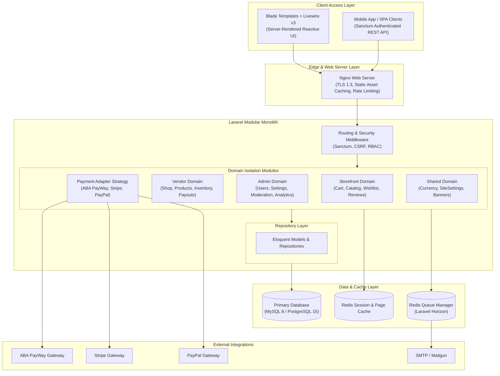

# TVR E-Commerce: System Architecture Overview

## Executive Summary
This document outlines the high-level architecture, module organization, data flow, scaling strategy, and non-functional specifications for the **TVR Multi-Vendor & Multi-Lingual Laravel E-Commerce Platform**.

---

## High-Level Architecture Diagram



---

## Domain Architecture Breakdown

The codebase enforces a **Modular Monolith** pattern inside `app/`:

```
app/
├── Http/
│   ├── Controllers/
│   │   ├── Admin/         # Admin REST / Resource Controllers
│   │   ├── Api/           # Public & Sanctum API Controllers
│   │   ├── Store/         # Storefront Blade Controllers
│   │   └── Vendor/        # Vendor Management Controllers
│   └── Middleware/        # Auth, Role, Security Middleware
├── Livewire/             # Reactive UI Components
├── Models/               # Eloquent Data Models
├── Repositories/         # Data Access Layer
│   ├── Admin/
│   ├── Shared/
│   └── Vendor/
└── Services/             # Domain Business Logic Layer
    ├── Admin/
    ├── PaymentGateway/    # Strategy Adapters (ABA, Stripe, PayPal)
    ├── Shared/
    ├── Store/
    └── Vendor/
```

---

## Non-Functional Requirements (NFRs)

### Performance
- **API Response Time**: `< 150ms` (p95) for cached catalog endpoints.
- **Livewire Search**: `< 100ms` real-time search filtering.
- **Database Execution**: `< 30ms` indexed queries.

### Availability & Reliability
- **Uptime Target**: `99.95%` availability.
- **RPO (Recovery Point Objective)**: `< 15 minutes` via transaction log backups.
- **RTO (Recovery Time Objective)**: `< 1 hour` via automated database failover.

### Security
- **Authentication**: Laravel Sanctum with token expiration & refresh strategies.
- **PCI DSS Compliance**: Offloaded payment capture via host checkout redirects & tokenized intent APIs (Stripe PaymentIntents, PayWay HMAC signatures).
- **Authorization**: Granular Role-Based Access Control (RBAC) separating Customers, Vendors, and Admin users.

---

## Failure Modes & Mitigations

| Failure Scenario | Business Impact | Mitigation & Recovery |
|------------------|-----------------|------------------------|
| Payment Gateway Outage | Customer unable to checkout with specific gateway | PaymentManager dynamically surfaces alternative operational gateways |
| Database Read Spike | Slow response on catalog pages | Offload query results to Redis cache & read-replicas |
| Mail Server Down | Delayed order confirmation emails | Async queue retry policies via Laravel Horizon without blocking user checkout |
